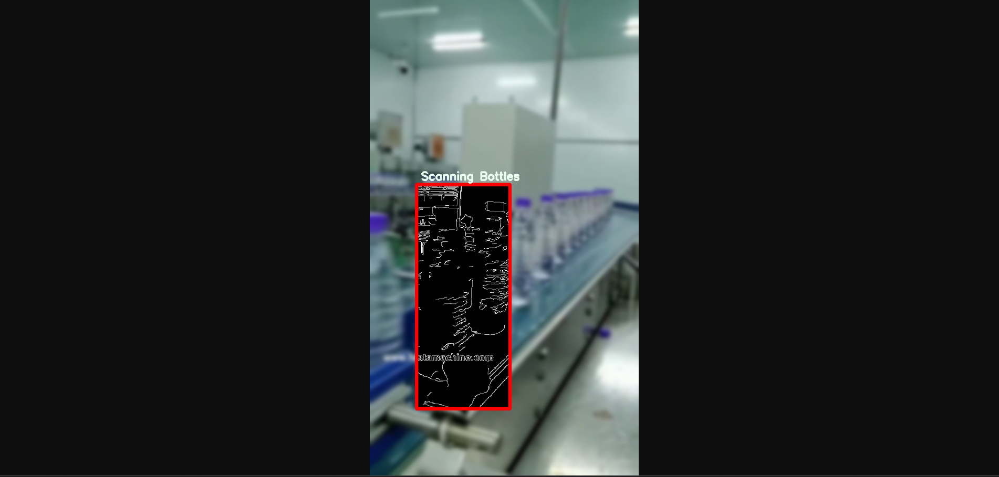
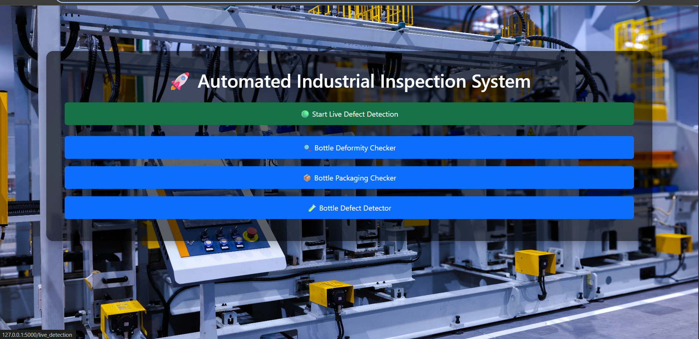
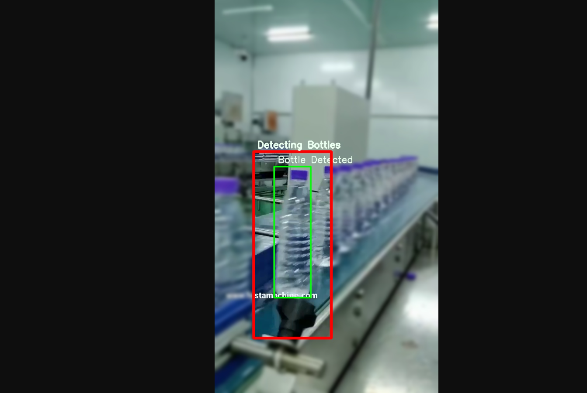

# 🤖 Automated Industrial Inspection System using Computer Vision

> A smart eye for industry — transforming traditional quality control into an AI-powered, high-precision inspection system.

---

## 🚀 Project Overview

In modern manufacturing, manual inspection is slow, inconsistent, and expensive.  
This project leverages the power of **Computer Vision** to build a fully automated system that **detects defects in real-time**, ensuring only flawless products leave the production line.

---

## 📸 Visual Demonstration

| Scanning Step | Page View | Defect Detection |
|---------------|-----------|------------------|
|  |  |  |

---

## 🎯 Key Features

✅ **Real-Time Detection**  
📦 **Supports Multiple Object Types**  
⚡ **High Speed & Accuracy**  
📈 **Scalable Architecture**  
🧠 **AI-Ready Pipeline (Extendable to ML Models)**

---

## 🛠️ Quick Start

### 🔧 1. Clone the Repo
```bash
git clone https://github.com/rajchandel866/visual-quality-control-system.git
cd visual-quality-control-system
